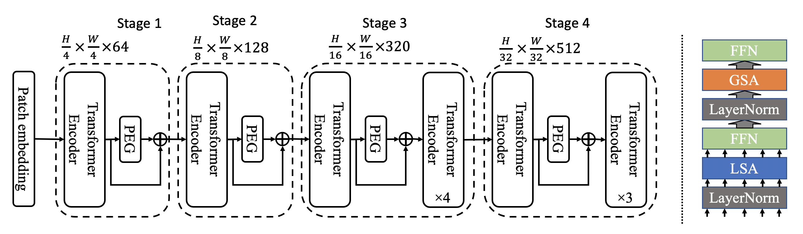

# Twins: Revisiting the Design of Spatial Attention in Vision Transformers [[Arxiv]](https://arxiv.org/pdf/2104.13840.pdf)


Very recently, a variety of vision transformer architectures for dense prediction tasks have been proposed and they show that the design of spatial attention is critical to their success in these tasks. In this work, we revisit the design of the spatial attention and demonstrate that a carefully-devised yet simple spatial attention mechanism performs favourably against the state-of-the-art schemes. As a result, we propose two vision transformer architectures, namely, Twins- PCPVT and Twins-SVT. Our proposed architectures are highly-efficient and easy to implement, only involving matrix multiplications that are highly optimized in modern deep learning frameworks. More importantly, the proposed architectures achieve excellent performance on a wide range of visual tasks including image- level classification as well as dense detection and segmentation. The simplicity and strong performance suggest that our proposed architectures may serve as stronger backbones for many vision tasks.


Figure 1. Twins-SVT-S Architecture (Right side shows the inside of two consecutive Transformer Encoders).

## Model Zoo

### Image Classification

We provide a series of Twins models pretrained on ILSVRC2012 ImageNet-1K dataset.

| Model | Alias in the paper | Acc@1 | FLOPs(G)|#Params (M) | URL | Log |
| --- | --- | --- | --- | --- |--- |---|
| PCPVT-Small| Twins-PCPVT-S | 81.2 | 3.7  | 24.1 | [pcpvt_small.pth](https://drive.google.com/file/d/1TWIx_8M-4y6UOKtbCgm1v-UVQ-_lYe6X/view?usp=sharing) | [pcpvt_s.txt](/logs/pcpvt_s.txt)
| PCPVT-Base | Twins-PCPVT-B | 82.7 | 6.4  | 43.8 | [pcpvt_base.pth](https://drive.google.com/file/d/1BsD3ZRivvPsHoZB1AX-tbirFLtCln8ky/view?usp=sharing) | [pcpvt_b.txt](/logs/pcpvt_b.txt)
| PCPVT-Large| Twins-PCPVT-L | 83.1 | 9.5  | 60.9 | [pcpvt_large.pth](https://drive.google.com/file/d/17xZXOWEcSGs0quBmMEkBYCxjPRYH-L45/view?usp=sharing) | [pcpvt_l.txt](/logs/pcpvt_l.txt)
| ALTGVT-Small | Twins-SVT-S   | 81.7 | 2.8  | 24   | [alt_gvt_small.pth](https://drive.google.com/file/d/131SVOphM_-SaBytf4kWjo3ony5hpOt4S/view?usp=sharing) |[svt_s.txt](/logs/svt_s.txt)
| ALTGVT-Base  | Twins-SVT-B   | 83.2 | 8.3  | 56   | [alt_gvt_base.pth](https://drive.google.com/file/d/1s83To8xgDWY6Ad8VBP3Nx9gqY709rrGu/view?usp=sharing)|[svt_b.txt](/logs/svt_b.txt)
| ALTGVT-Large | Twins-SVT-L   | 83.7 | 14.8 | 99.2 | [alt_gvt_large.pth](https://drive.google.com/file/d/1um39wxIaicmOquP2fr_SiZdxNCUou8w-/view?usp=sharing)|[svt_l.txt](/logs/svt_l.txt)

#### Training

To train Twins-SVT-B on ImageNet  using 8 gpus for 300 epochs run:

```python
python -m torch.distributed.launch --nproc_per_node=8 --use_env main.py --model alt_gvt_base --batch-size 128 --data-path path_to_imagenet --dist-eval --drop-path 0.3
```

#### Evaluation 

To evaluate the performance of Twins-SVT-L on ImageNet using one GPU.

```python
python main.py --eval --resume alt_gvt_large.pth  --model alt_gvt_large --data-path path_to_imagenet
```

This should give

```
* Acc@1 83.660 Acc@5 96.512 loss 0.722
Accuracy of the network on the 50000 test images: 83.7%
```

## Todo

- [] Detection and segmentation.

## Citation

```
@article{chu2021Twins,
	title={Twins: Revisiting the Design of Spatial Attention in Vision Transformers},
	author={Xiangxiang Chu and Zhi Tian and Yuqing Wang and Bo Zhang and Haibing Ren and Xiaolin Wei and Huaxia Xia and Chunhua Shen},
	journal={Arxiv preprint 2104.13840},
	url={https://arxiv.org/pdf/2104.13840.pdf},
	year={2021}
}
```

## Acknowledgement

We heavily borrow the code from [DeiT](https://github.com/facebookresearch/deit) and [PVT](https://github.com/whai362/PVT).
We test throughputs as in [Swin Transformer](https://github.com/microsoft/Swin-Transformer).

## License
This repository is released under the Apache 2.0 license as found in the [LICENSE](LICENSE) file.
